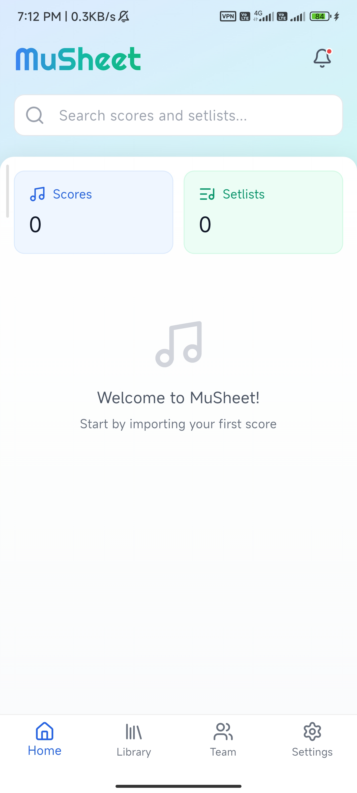
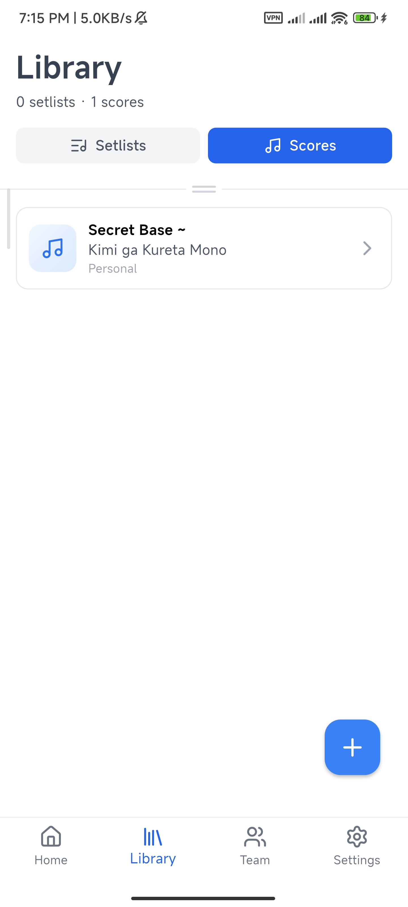

<div align="center">

# MuSheet

**A Modern Digital Sheet Music Management App for Musicians and Bands**

[](https://flutter.dev)
[](https://dart.dev)
[](https://serverpod.dev)
[](LICENSE)

*Streamline your music performance workflow with powerful PDF viewing, annotations, and team collaboration.*

</div>

---

## Screenshots

<p align="center">
  
  &nbsp;&nbsp;
  
  &nbsp;&nbsp;
  
</p>

---

## Features

### Core Functionality

| Feature | Description |
|---------|-------------|
| **PDF Score Viewer** | High-performance rendering with smooth scrolling and zoom |
| **Annotations** | Draw, highlight, and erase with full undo/redo support |
| **Multi-Instrument** | One score, multiple instrument parts for ensemble management |
| **Setlist Management** | Organize repertoire for performances and rehearsals |
| **Built-in Metronome** | Integrated practice tool with customizable tempo |

### Collaboration & Sync

| Feature | Description |
|---------|-------------|
| **Team Collaboration** | Share scores and setlists with role-based permissions |
| **Offline-First** | Full functionality without internet, automatic sync when connected |
| **Cloud Backup** | Secure cloud storage with Supabase integration |
| **Cross-Device Sync** | Seamless experience across all your devices |

---

## Architecture

```
┌─────────────────────────────────────────────────────────────┐
│                      Flutter Client                         │
│  ┌─────────────┐  ┌─────────────┐  ┌─────────────────────┐ │
│  │  Riverpod   │  │    Drift    │  │   PDF Viewer        │ │
│  │   (State)   │  │  (SQLite)   │  │ (pdfrx/Syncfusion)  │ │
│  └─────────────┘  └─────────────┘  └─────────────────────┘ │
└───────────────────────────┬─────────────────────────────────┘
                            │
                            ▼
┌─────────────────────────────────────────────────────────────┐
│                    Serverpod Backend                        │
│  ┌─────────────┐  ┌─────────────┐  ┌─────────────────────┐ │
│  │  REST API   │  │ PostgreSQL  │  │   File Storage      │ │
│  │  Endpoints  │  │  Database   │  │   (Supabase)        │ │
│  └─────────────┘  └─────────────┘  └─────────────────────┘ │
└─────────────────────────────────────────────────────────────┘
```

---

## Tech Stack

| Layer | Technology |
|-------|------------|
| **Frontend** | Flutter, Riverpod, GoRouter |
| **Local Storage** | Drift (SQLite) |
| **Backend** | Serverpod 3.1 |
| **Database** | PostgreSQL, Redis |
| **Cloud Storage** | Supabase |
| **PDF** | pdfrx, Syncfusion PDF Viewer |
| **Annotations** | Scribble, Perfect Freehand |

---

## Getting Started

### Prerequisites

- Flutter SDK 3.9+
- Dart SDK 3.9+
- Docker & Docker Compose (for backend)

### Client Setup

```bash
# Clone the repository
git clone https://github.com/your-username/musheet.git
cd musheet

# Install dependencies
flutter pub get

# Generate database code
dart run build_runner build

# Run the app
flutter run
```

### Server Setup

```bash
# Navigate to server directory
cd server

# Copy environment template
cp .env.example .env
# Edit .env with your configuration

# Start database services
docker-compose up -d postgres redis

# Navigate to server project
cd musheet_server

# Install dependencies
dart pub get

# Generate Serverpod protocol
serverpod generate

# Apply database migrations
dart run bin/main.dart --apply-migrations

# Start the server
dart run bin/main.dart
```

### Server Endpoints

The server provides RESTful APIs for:

| Category | Endpoints |
|----------|-----------|
| **Auth** | Login, Logout, Password Management |
| **Scores** | CRUD operations, PDF upload/download |
| **Setlists** | Create, organize, and share setlists |
| **Teams** | Team management, invitations, permissions |
| **Sync** | Push/pull changes, conflict resolution |
| **Admin** | User management, system monitoring |

> For detailed API documentation, see [Server README](server/README.md)

---

## Project Structure

```
musheet/
├── lib/                    # Flutter application
│   ├── core/              # Business logic
│   │   ├── data/          # Data sources (local/remote)
│   │   ├── repositories/  # Repository pattern
│   │   └── sync/          # Sync coordination
│   ├── database/          # Drift database schema
│   ├── models/            # Data models
│   ├── providers/         # Riverpod providers
│   ├── screens/           # UI screens
│   ├── widgets/           # Reusable widgets
│   └── router/            # GoRouter configuration
│
├── server/                 # Serverpod backend
│   ├── musheet_server/    # Main server project
│   ├── musheet_client/    # Generated client
│   ├── docker-compose.yml # Docker orchestration
│   └── scripts/           # Deployment scripts
│
└── assets/                 # Static assets
    ├── fonts/
    ├── icons/
    └── sounds/
```

---

## Development

```bash
# Run code generation (after model changes)
dart run build_runner build

# Analyze code
flutter analyze

# Run tests
flutter test

# Generate Serverpod protocol (after endpoint changes)
cd server/musheet_server
serverpod generate
```

---

## License

This project is licensed under the MIT License - see the [LICENSE](LICENSE) file for details.

---

<div align="center">

**Built with Flutter and Serverpod**

</div>
